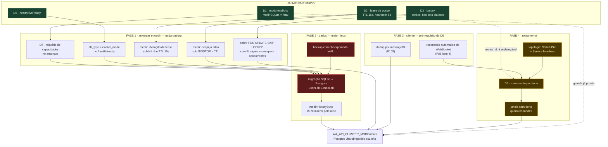

# ADR-0007: o caminho para multi-pod, e por que Postgres não é o primeiro passo

- **Status**: proposed — **quatro decisões em aberto**, marcadas abaixo
- **Data**: 2026-08-10
- **Relacionado**: ADR-0005 (D1, D2, D3, D5, D6, D7), F85, F103, F104 em
  `HOUSEKEEP.md`

## Contexto

O ADR-0005 decidiu **o que** multi-pod exige. Este decide **em que ordem**, e
registra o que já existe — porque metade da fundação está pronta e a outra
metade não é a que se imagina.

### O que JÁ está implementado, e costuma ser subestimado

**"Tornar Postgres obrigatório" não é trabalho a fazer.** É o D1, e está no
código: com `WA_API_CLUSTER_MODE=multi`, SQLite vira erro fatal de arranque
(`pkg/bootstrap/cluster.go:82-89`), com mensagem nomeando as variáveis que
faltam.

**O store do protocolo já fala Postgres.** `pkg/bootstrap/main.go:375` já chama
`sqlstore.New(ctx, "postgres", ...)`. As tabelas `wanoise_*` — device, chaves de
identidade, sessões Signal, prekeys — não são SQLite-only. Se fossem, seria
bloqueio absoluto.

**A chave de roteamento já está gravada e é endereçável.** O `owner_id` do lease
é `hostname-PID` (`pkg/bootstrap/lease.go:112-124`), e em k8s o hostname é o
nome do pod. O D5 não precisa inventar registro de serviço: ele já está na
tabela `session_leases`.

### O que NÃO está, e é o trabalho real

O gargalo não é banco. É **roteamento (D5)**, **migração de dados** e
**resiliência de cliente** — e os três dependem um do outro numa ordem que não
é a intuitiva.

## O grafo de dependências

Três leituras que o grafo torna óbvias e a lista não tornava:

1. **A Fase 1 não depende de nada** além do que já existe. É o único bloco que
   pode começar hoje, e é o mais barato.
2. **`MIG` é o gargalo de tudo**, e tem `BK` como pré-requisito duro. Migração
   sem backup é irreversível.
3. **`RC` (reconexão do cliente) bloqueia o D5**, e não o contrário. Isso é
   contra-intuitivo: parece detalhe de front-end, e é pré-requisito de
   arquitetura.

## Decisão

### Fase 1 — enxergar e medir

Nada aqui muda comportamento. Pode entrar a qualquer momento, em commits
separados.

| item | o que | por quê |
|---|---|---|
| D7 | relatório de capacidades no arranque | hoje `database=sqlite, mode=single` só se descobre lendo código (F104) |
| `/health/ready` | expor `db_type` e `cluster_mode` | torna o estado auditável de fora, por quem for escalar |
| medição 1 | liberação de lease sob `kill -9`, TTL 15s | **nunca medida**; o `kill -9` que existe validou o OUTBOX, não o lease |
| medição 2 | despejo falso sob `SIGSTOP` acima do TTL | despejo falso em produção = duas sessões se achando donas |
| medição 3 | `FOR UPDATE SKIP LOCKED` com Postgres real | o ramo existe e **nunca rodou** — o próprio `webhook_outbox_test.go:17` admite |

Sem as medições 1 e 2, o TTL de 15s é chute com aparência de decisão.

### Fase 2 — dados

**`BK` antes de tudo.** Backup com checkpoint do WAL: copiar SQLite com WAL
aberto produz cópia inconsistente, e é o erro mais comum desse tipo de rotina.

**`MIG` é a fase que pode custar todas as sessões.** O crítico é
`wanoise_device` e as chaves de identidade: se não atravessarem íntegros, toda
sessão precisa de QR novo. Não é perda de histórico — é perda de credencial.

Exige ensaio contra cópia da produção, verificação linha a linha das tabelas de
criptografia, e plano de volta.

**`PERF` não é opcional.** A rajada de HistorySync são 15.700 inserts, medidos.
Hoje são locais; contra Postgres, cada um vira ida e volta pela rede. Medir
antes, não depois.

### Fase 3 — cliente

**`RC`** — o painel não reconecta **de jeito nenhum** hoje (F85, reproduzido em
bancada). Roteamento por dono pressupõe cliente que reconecta quando a sessão
troca de pod. Esse cliente não existe.

**`DD`** — já entregamos duplicado numa reentrega do WhatsApp (F103). Com troca
de dono, piora: a janela entre lease expirado e novo dono é exatamente quando
reentregas acontecem.

### Fase 4 — roteamento

> **DECISÃO EM ABERTO (1 de 4) — topologia.**
> **(a) StatefulSet + Service headless.** Pod ganha nome estável e resolve por
> DNS (`pod-0.svc`), que é o que o `owner_id` já grava. Combina com sessão
> pegajosa, que é o que isto é.
> **(b) Deployment + consulta à API do k8s** para resolver pod por nome. Nomes
> são aleatórios e não resolvem por DNS individualmente.
>
> **Recomendo (a)**: o `owner_id` já está no formato certo, e sessão pegajosa é
> a natureza do problema, não um efeito colateral.

> **DECISÃO EM ABERTO (2 de 4) — onde roteia.**
> **(a) Encaminhamento pod-a-pod**: o pod que recebe consulta `session_leases` e
> repassa ao dono. Simples de operar, custa um salto extra.
> **(b) Roteamento no ingress**: a camada de entrada consulta o lease e manda
> direto. Sem salto, mas exige lógica de aplicação no ingress.
>
> **Recomendo (a) primeiro**: funciona com qualquer ingress, e o custo do salto
> é irrelevante perto do que já se gasta em rede com Postgres. (b) vira
> otimização se a medição justificar.

> **DECISÃO EM ABERTO (3 de 4) — a janela sem dono.**
> Entre o lease expirar e outro pod reivindicar existem segundos sem dono
> nenhum. O que responde uma requisição nesse intervalo?
> **(a) 503 com `Retry-After`** — honesto, e o cliente já precisa lidar com isso.
> **(b) Segurar a requisição** até alguém assumir, com prazo.
>
> **Recomendo (a)**: segurar requisição sob indisponibilidade é como se
> constroem cascatas de esgotamento de conexão.

> **DECISÃO EM ABERTO (4 de 4) — uma entrega ou duas.**
> **(a) Duas entregas**: migrar para Postgres **continuando em `single`**,
> depois ligar `multi`. Ganha backup decente e PITR já na primeira, e a migração
> de dados acontece sem a pressa de ter dois pods.
> **(b) Uma entrega**: Postgres e multi-pod juntos.
>
> **Recomendo (a)**: divide o maior risco (`MIG`) da maior complexidade (`D5`)
> em duas janelas. Misturar as duas numa só é como migrações falham.

### Fase 5 — ligar

`WA_API_CLUSTER_MODE=multi`. O D1 passa a exigir Postgres sozinho, e recusa
subir se ele não estiver lá. Nenhum código novo.

## Consequências

**O ganho não é desempenho.** SQLite não é gargalo medido em lugar nenhum; a F87
mostrou que o gargalo era o laço de nós, não o banco. O ganho de multi-pod é
**disponibilidade durante deploy** — hoje um deploy custa 1,16s a 2,29s por
sessão, sem QR e sem perder webhook (o outbox garante). Se esse número for
aceitável, este ADR inteiro pode esperar.

**O custo é operacional, não de código.** Um Postgres a manter, backup dele,
`max_connections`, e uma topologia com StatefulSet. Some-se a latência de rede
em cada escrita do ratchet — que hoje é chamada de função.

**A parte irreversível é `MIG`.** Depois que as sessões estiverem em Postgres,
voltar para SQLite é outra migração, não um rollback.

**Nada aqui reduz risco de perda de dado sozinho.** Os dois riscos reais de hoje
— sem backup, e volume possivelmente efêmero — se resolvem na Fase 1/2 e
**não** dependem de Postgres. Quem adotar este ADR pelo motivo errado ("ficamos
mais seguros") vai gastar muito para não mover essas duas linhas.

## Follow-ups

- Política de retenção do outbox (herdado do ADR-0005, ainda em aberto).
- Reavaliar D5/Redis depois que o roteamento por dono estiver medido.
- Ensaio de restauração — backup que nunca foi restaurado não é backup.
