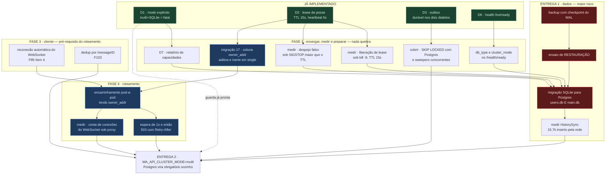
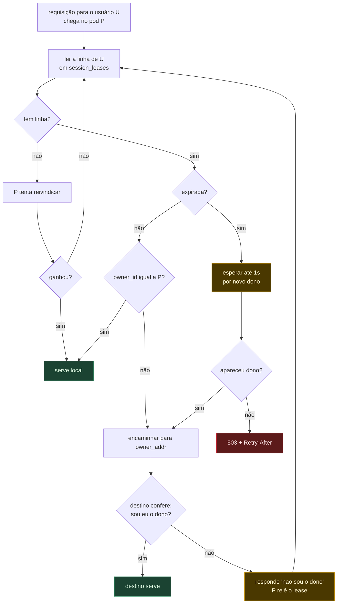
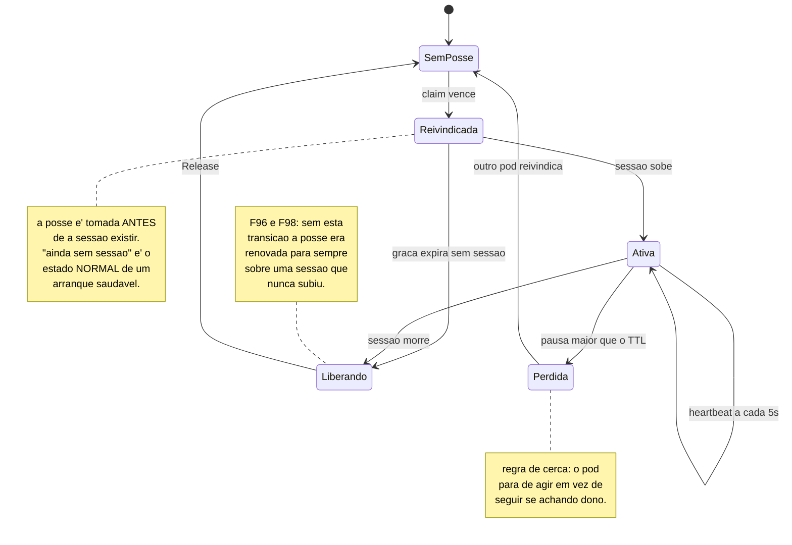

# ADR-0007: o caminho para multi-pod, e por que Postgres não é o primeiro passo

- **Status**: **accepted (2026-08-10)** — as quatro decisões em aberto foram
  tomadas; implementação **não iniciada**. As alternativas recusadas ficam
  registradas, com o motivo.
- **Data**: 2026-08-10
- **Relacionado**: ADR-0005 (D1, D2, D3, D5, D6, D7), F85, F86, F103, F104 em
  `HOUSEKEEP.md`

## Contexto

O ADR-0005 decidiu **o que** multi-pod exige. Este decide **em que ordem**, e
registra o que já existe — porque metade da fundação está pronta e a outra
metade não é a que se imagina.

### O que JÁ está implementado, e costuma ser subestimado

**"Tornar Postgres obrigatório" não é trabalho a fazer.** É o D1, e está no
código: com `WA_API_CLUSTER_MODE=multi`, SQLite vira erro fatal de arranque
(`pkg/bootstrap/cluster.go:82-89`), com mensagem nomeando as variáveis que
faltam.

**O store do protocolo já fala Postgres.** `pkg/bootstrap/main.go:375` já chama
`sqlstore.New(ctx, "postgres", ...)`. As tabelas `wanoise_*` — device, chaves de
identidade, sessões Signal, prekeys — não são SQLite-only. Se fossem, seria
bloqueio absoluto.

**A posse já existe e já foi depurada.** O lease do D2 tem TTL, heartbeat, regra
de cerca, e sobreviveu a dois defeitos encontrados em bancada (F96 e F98).

### O que NÃO está, e é o trabalho real

Roteamento, migração de dados e resiliência de cliente — e os três dependem um
do outro numa ordem que não é a intuitiva.

## Grafo 1 — dependências entre as fases



Quatro leituras que o grafo torna óbvias e a lista não tornava:

1. **A Fase 1 não depende de nada** além do que já existe. É o único bloco que
   pode começar hoje, e é o mais barato.
2. **`MIG` é o gargalo de tudo**, e a corrente `BK → REST → MIG` é dura.
   Migração sem backup é irreversível; backup sem ensaio de restauração **não é
   backup**, é um arquivo com nome tranquilizador.
3. **`RC` bloqueia `FWD`**, e não o contrário. Contra-intuitivo: parece detalhe
   de front-end, é pré-requisito de arquitetura.
4. **Topologia sumiu do grafo.** Era um nó da Fase 4 na versão anterior; a
   decisão 1 a eliminou. `ADDR` a substitui, é aditiva e cabe na Fase 1.

## Decisões

### Decisão 1 — o endereço do dono mora no lease

> **DECIDIDO.** Uma coluna nova, escrita por quem reivindica:
>
> ```sql
> ALTER TABLE session_leases ADD COLUMN owner_addr TEXT NOT NULL DEFAULT '';
> ```
>
> **Recusadas:** *(a) StatefulSet + Service headless* e *(b) Deployment +
> consulta à API do k8s*.

**Por quê.** Quem vai rotear lê a posse e o endereço **na mesma linha, na mesma
consulta, escritos pela mesma transação**. Não existe caminho em que divirjam.

(a) funcionaria — o `owner_id` já é `hostname-PID`, e em StatefulSet o hostname
resolve por DNS. Mas amarra a arquitetura a uma topologia de k8s, e não vale em
compose.

(b) é pior: põe o API server **no caminho quente**. Todo roteamento passaria a
depender do plano de controle do cluster, que fica lento sob pressão. Acoplar
entrega de mensagem ao API server é criar um modo de falha que não existe hoje.

**Auto-correção, e por que ela basta.** IP de pod é reciclado; um lease velho
pode apontar para outro pod. O destino confere se o `owner_id` da linha é o
dele:

- é → serve;
- não é → responde "não sou o dono", e o chamador relê o lease.

O erro é **detectável e transitório**, nunca silencioso. É a propriedade que
faltava nas outras duas opções.

**Custo:** migração 17 (aditiva), e o pod precisa saber o próprio endereço
alcançável — `POD_IP` pela downward API em k8s, nome do container em compose.

### Decisão 2 — encaminhamento pod-a-pod, com a conta do WebSocket medida

> **DECIDIDO.** O pod que recebe consulta o lease e encaminha ao dono.
> **Recusada:** lógica de roteamento no ingress.

**Por quê.** Funciona com qualquer ingress, sem configuração especial. A lógica
fica no nosso código, testável com `go test` e visível no nosso log de
fronteira. Roteamento no ingress exigiria a camada de entrada consultando o
banco — o que quase nunca é aceitável — ou um serviço roteador novo para manter.

**O custo, declarado antes de aparecer.** Para HTTP o salto é irrelevante. Para
**WebSocket não é**: `/session/ws` é conexão longa, e encaminhar significa o pod
do meio segurar **duas** conexões pela sessão inteira. Com N clientes, 2N
conexões, e o pod intermediário vira ponto único de falha para um fluxo do qual
não é dono.

Por isso `WSC` está no grafo como item de medição, não como suposição.

**Se o número incomodar, a saída NÃO é o ingress**: é um endpoint REST
*"onde eu conecto?"* devolvendo o endereço do dono, com o cliente abrindo o
WebSocket direto. Exige cada pod externamente alcançável — caro em k8s — mas não
segura conexão de ninguém. Fica registrado como plano B, não como plano.

### Decisão 3 — espera curta, depois 503

> **DECIDIDO.** Na janela sem dono: esperar **até 1 segundo** por um novo dono;
> não aparecendo, responder **503 com `Retry-After`**.
> **Recusada:** segurar a requisição até alguém assumir.

**Por quê a espera curta.** A troca de dono é rápida — 1,16s a 2,29s medidos
para a sessão subir. Um segundo absorve boa parte dos casos sem que ninguém
perceba.

**Por quê o teto.** Segurar sem limite é **exatamente a F86**: rajada virando
goroutines sem teto, sem backpressure. Já pagamos esse preço e construímos um
pool com fila para não pagar de novo. Sob falha em massa — um pod morre com 100
sessões — seriam centenas de requisições presas por até 15 segundos, o TTL
inteiro, disparando todas juntas quando o novo dono aparecesse. Manada em cima
de um pod que acabou de assumir.

Espera **limitada** é outra coisa de espera **indefinida**. O que a F86 puniu foi
a segunda.

**Pré-requisito que isto cria.** 503 exige cliente que retenta, e os nossos não
retentam (F85). É mais uma seta apontando para `RC` — não como acompanhamento,
como bloqueio.

### Decisão 4 — duas entregas, Postgres primeiro

> **DECIDIDO.** Entrega 1: migrar para Postgres **continuando em `single`**.
> Entrega 2: ligar `multi`.
> **Recusada:** as duas juntas numa janela.

**Por quê.** Quatro razões, e a última é decisiva:

1. **Valor imediato e independente.** Backup e PITR chegam na Entrega 1, sem
   depender de nada das Fases 3 e 4 — e são os dois riscos reais de hoje.
2. **Uma variável por vez.** Se a rajada de HistorySync sofrer pela rede, você
   descobre com a topologia inalterada.
3. **Aprendizado operacional antes da complexidade.** Semanas com Postgres em
   produção ensinam `max_connections`, latência de escrita do ratchet e perfil
   de vacuum — antes de acrescentar pods.
4. **Rollback assimétrico.** Voltar topologia é mudar a réplica para 1. Voltar
   dados **não é** — depois que as sessões estão em Postgres, retornar a SQLite
   é outra migração, não um rollback. Juntar as duas deixa a parte fácil de
   desfazer refém da impossível.

**O risco não está no código.** A migração 15 foi conferida nos dois dialetos e
há cobertura contra Postgres real. Está nos dados — que é precisamente o que a
entrega separada isola.

## Grafo 2 — o caminho de uma requisição sob roteamento



O laço `RELER → LER` é a auto-correção da decisão 1: endereço obsoleto não
produz resposta errada, produz uma releitura. É o que torna seguro guardar um
endereço que pode envelhecer.

## Grafo 3 — a máquina de estados da posse, com as lições da F96 e da F98



O período de graça em `Reivindicada` é a sutileza que custou dois defeitos: a
posse é reivindicada **antes** de a sessão materializar, então "não tem sessão"
não pode ser tratado como erro — só passa a ser depois da graça, que é igual ao
TTL.

## Plano detalhado

### Fase 1 — enxergar, medir e preparar

Nada muda comportamento. Commits separados, sem janela.

| item | o que | por quê |
|---|---|---|
| `D7` | relatório de capacidades no arranque | hoje `database=sqlite, mode=single` só se descobre lendo código (F104) |
| `HR` | `db_type` e `cluster_mode` no `/health/ready` | estado auditável de fora, por quem for escalar |
| `ADDR` | migração 17, coluna `owner_addr` | aditiva e **inerte em `single`**, onde a posse nem é reivindicada |
| `M1` | liberação de lease sob `kill -9`, TTL 15s | **nunca medida** — o `kill -9` existente validou o OUTBOX, não o lease |
| `M2` | despejo falso sob `SIGSTOP` acima do TTL | despejo falso = duas sessões se achando donas |
| `M3` | `SKIP LOCKED` com Postgres e sweepers concorrentes | o ramo existe e **nunca rodou** (`webhook_outbox_test.go:17` admite) |

Sem `M1` e `M2`, o TTL de 15s é chute com aparência de decisão.

### Entrega 1 — dados

**`BK` → `REST` → `MIG`, nessa ordem, sem atalho.**

`REST` não é zelo: backup nunca restaurado não é backup. O ensaio precisa
produzir uma instância que **pareia, recebe mensagem e entrega webhook** — não
apenas um arquivo que abre.

`MIG` é a fase que pode custar todas as sessões. O crítico é `wanoise_device` e
as chaves de identidade: sem elas íntegras, toda sessão precisa de QR novo. Não
é perda de histórico, é perda de credencial.

`PERF` mede a rajada de HistorySync — 15.700 inserts, hoje locais, que passam a
ser ida e volta pela rede.

### Fase 3 — cliente

`RC` — reconexão com recuo exponencial e aviso visível de "reconectando". Hoje o
painel não reconecta **de jeito nenhum**, e exibe a sessão como conectada (vem
do REST) com o fluxo de eventos morto (vem do WebSocket). Mente em silêncio.

`DD` — dedup por `messageID`. Já entregamos duplicado numa reentrega do WhatsApp
(F103); a janela entre lease expirado e novo dono é exatamente quando reentregas
acontecem.

### Fase 4 — roteamento

`FWD` conforme o Grafo 2. `WAIT` conforme a decisão 3. `WSC` mede a conta de
conexões antes que ela cresça.

### Entrega 2 — ligar

`WA_API_CLUSTER_MODE=multi`. O D1 passa a exigir Postgres sozinho e recusa subir
sem ele. **Nenhum código novo.**

## Consequências

**O ganho não é desempenho.** SQLite não é gargalo medido em lugar nenhum; a F87
mostrou que o gargalo era o laço de nós, não o banco. O ganho é
**disponibilidade durante deploy** — hoje um deploy custa 1,16s a 2,29s por
sessão, sem QR e sem perder webhook. Se esse número for aceitável, este ADR pode
esperar, e essa é uma resposta legítima.

**O custo é operacional.** Um Postgres a manter, backup dele, `max_connections`,
e latência de rede em cada escrita do ratchet — que hoje é chamada de função.

**A parte irreversível é `MIG`.**

**Nada aqui reduz risco de perda de dado sozinho.** Os dois riscos reais —
ausência de backup e volume possivelmente efêmero — se resolvem na Fase 1 e na
Entrega 1, e **não dependem de Postgres**. Quem adotar este ADR pelo motivo
errado ("ficamos mais seguros") vai gastar muito sem mover essas duas linhas.

## Follow-ups

- Política de retenção do outbox (herdado do ADR-0005, ainda em aberto).
- Reavaliar Redis (D5 do ADR-0005) só depois de `WSC` medido.
- Plano B do WebSocket (endpoint "onde eu conecto?") se `WSC` mostrar que 2N
  conexões não cabem.
